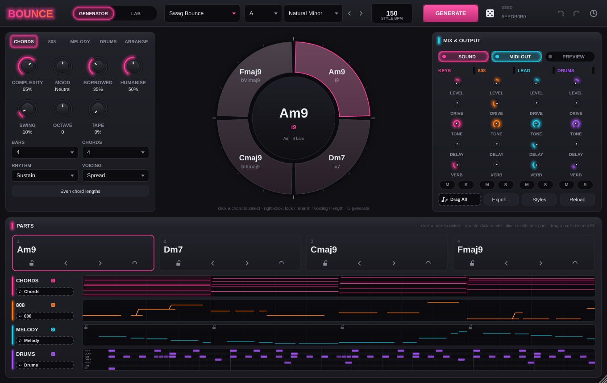
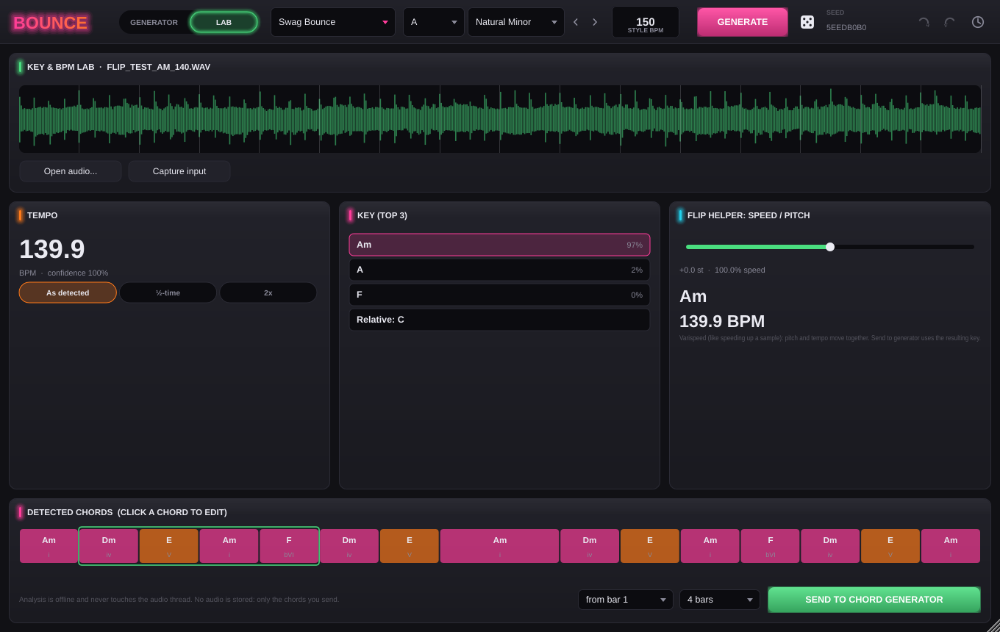
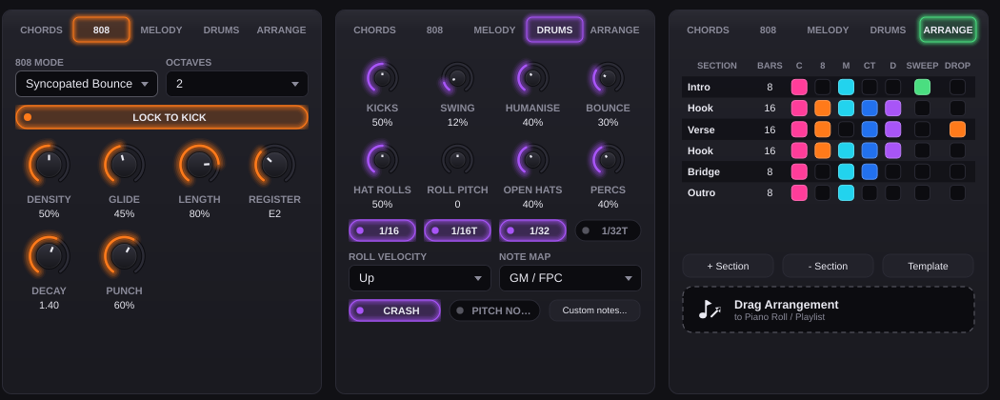

# BOUNCE

A VST3/AU instrument that sketches the building blocks of **swag / bounce** type beats (chords,
808s, melodies, bouncy drums), helps flip existing songs, and gets everything into FL Studio's
Piano Roll with a drag.



> **Status: milestones 1–5 are implemented.** It's been tested with unit and engine tests,
> pluginval (strictness 10) and screenshots on Linux. CI builds and validates on Windows and
> macOS. **It hasn't been tested inside FL Studio yet**: see the checklist in
> [`docs/MILESTONES.md`](docs/MILESTONES.md#fl-studio-test-checklist).

## What it does

| Module | Highlights |
|---|---|
| **Chords** | Weighted-Markov harmony from JSON style presets. Controls: key, mode, 2/4/8 bars, 1–8 chords, complexity (triads → 11ths), mood, borrowed chords. Per chord: lock, reharmonise, invert, octave, voicing, **length**. Rhythms: sustain, half, syncopated stabs, 8th pulse, with strum, swing and humanise. Chord names and roman numerals everywhere. |
| **808** | Root Follow, Syncopated Bounce, Octave Jumper, Glide Heavy and Sustain modes. Density, glide, octave range, note length, register, and **lock to kick**. Glides are written as overlapping notes plus CC65/CC5 portamento, so FL's 808s slide too. |
| **Melody** | A motif with repetition, a catchiness control, call & response, and straight/swung/triplet feel. A pentatonic control sets how much the line favours pentatonic notes. Strong beats land on chord tones. **Per-bar lock**, plus an optional **counter-melody** that fills gaps in contrary motion and avoids clashes. |
| **Drums** | Kick, clap, hats, open hat, perc, rim and FX lanes with a half-time backbone. Hat rolls in 1/16, 1/16T, 1/32 and 1/32T, with velocity curves and pitch ramps. Stutters, swing, humanise and a **bounce** control that pushes hits off-grid. Output uses the GM/FPC note map or your own. |
| **Key & BPM Lab** | Load WAV/MP3/FLAC/OGG/AIFF, or capture the plugin input, and analysis runs on a background thread. You get BPM (with ½× and 2× options), the top 3 keys with confidence plus the relative key, and an editable chord lane. **Send to Chord Generator** turns the chords into locked slots with their real lengths, and a speed/pitch flip helper is included. |
| **Arrange** | Intro/Hook/Verse/Bridge/Outro sections with per-part mutes, a drop in the last bar, CC74 filter sweeps and marker names, exported as one multi-track MIDI file. |
| **Sound** | Keys/pad with tape wobble, a mono 808 with punch and glide, a bell/pluck/flute lead, and a drum sampler. The bundled kit is **synthesised by the plugin itself**, and you can load your own samples per lane. Each part has level, mute/solo, drive, low-pass, delay and reverb. |

Everything is generated from **seeds**. The same seed and settings give the same idea on every
OS. Generate re-rolls everything, the dice on each part re-rolls only that part, and turning a
knob re-colours the current idea. Every edit can be undone, and the history keeps the last 50
ideas. The full state is saved with the FL project.

### Getting MIDI into FL Studio
1. **Drag & drop.** Every part has a drag tile; drop it on the Piano Roll or the Playlist.
   *Drag All* gives a multi-track file, and *Drag Arrangement* gives the whole sketched song.
2. **MIDI out.** Chords play on the MIDI channel you set, the 808 on +1, melody on +2,
   counter-melody on +3 and drums on channel 10. In FL, set an *Output port* in the wrapper
   settings and the same *Input port* on the target instrument.
3. **Export...** writes every part plus the arrangement as files named like
   `Fmaj9-Am9-Dm7-Cmaj9_Am_150bpm_808.mid`.





## Building

You need CMake 3.22+ and a C++20 compiler (Visual Studio 2022, Xcode 15+, or GCC 11+/Clang 14+).
JUCE 8.0.9 and doctest are fetched automatically at configure time. No other dependencies.

```sh
# Windows
cmake -S . -B build -G "Visual Studio 17 2022" -A x64
cmake --build build --config Release --parallel

# macOS (universal)
cmake -S . -B build -G Xcode "-DCMAKE_OSX_ARCHITECTURES=arm64;x86_64"
cmake --build build --config Release --parallel

# Linux
sudo apt install libasound2-dev libx11-dev libxrandr-dev libxinerama-dev libxext-dev \
                 libxcursor-dev libxcomposite-dev libfreetype-dev libfontconfig1-dev
cmake -S . -B build -G Ninja -DCMAKE_BUILD_TYPE=Release && cmake --build build

# Tests (any OS)
ctest --test-dir build -C Release --output-on-failure
```

Artefacts are written to `build/plugin/Bounce_artefacts/Release/{VST3,AU,Standalone}`. On
Windows, copy `Bounce.vst3` into `C:\Program Files\Common Files\VST3\`. On macOS, copy it into
`~/Library/Audio/Plug-Ins/VST3/` (and `Bounce.component` into `.../Components/`).

To build just the core (no JUCE, very fast), add `-DBOUNCE_BUILD_PLUGIN=OFF`. To build offline,
pass `-DFETCHCONTENT_SOURCE_DIR_JUCE=... -DFETCHCONTENT_SOURCE_DIR_DOCTEST=...`.

CI (`.github/workflows/build.yml`) builds on Windows, macOS and Linux, runs both test suites,
and runs [pluginval](https://github.com/Tracktion/pluginval) at strictness level 10.

## Using it

- **Window.** It opens at the largest size that fits your screen (up to 100%). Drag the corner
  to resize between 75% and 200%; the size is remembered per project.
- **Keyboard.** `G` generate · `L` lock · `R` reharmonise · `1–8` select chord · `←/→` previous/next ·
  `↑/↓` invert · `Ctrl/Cmd+Z` undo · `Ctrl/Cmd+Shift+Z` / `Ctrl+Y` redo.
- **Mini piano rolls.** Click a note to delete it and double-click to add one. The lock icons on
  the melody lane freeze single bars. Right-click a drum lane name to load your own sample.
- **Chords.** Right-click a chord (in the wheel, a card or the lane) to lock it, reharmonise it,
  change its voicing or octave, or make it **longer or shorter**.
- **Lab.** Drop audio onto the Lab, pick the BPM (½× or 2×) and the key, fix any wrong chords
  by clicking them, choose a start bar and a length, then **Send to Chord Generator**. The
  chords arrive locked: unlock some and press Generate for a variation, or reharmonise.

## Style presets

The styles are *Swag Bounce*, *Sped-Up Flip*, *Dark Swag*, *Plugg-ish* and
*Melodic R&B Bounce*, stored as JSON in [`presets/styles`](presets/styles). Each one sets the
harmony tables and chord colours, voicing, rhythm, 808 mode, melody feel and drum vocabulary.
Add your own in the user styles folder (the **Styles** button opens it), then press **Reload**.
The format is documented in [`presets/styles/README.md`](presets/styles/README.md).

## Repository layout

```
core/      bounce_core: pure C++20, no JUCE. Theory, generators, analysis, MIDI, JSON.
plugin/    JUCE plugin: processor, Engine (real-time DSP), State (session, params), Analysis (Lab), UI.
presets/   Style presets (JSON), bundled into the binary.
tests/     Core unit tests and engine tests (real-time player, voices, sampler, mixer).
docs/      Architecture, milestone reports, screenshots.
```

See [`docs/ARCHITECTURE.md`](docs/ARCHITECTURE.md) for the design and threading model, and
[`docs/MILESTONES.md`](docs/MILESTONES.md) for each milestone's decisions and known limitations.

## Licensing notes

No audio is bundled: the drum kit is synthesised by the plugin at startup. The Lab only
analyses audio you load, and stores nothing but the chords you send. JUCE is used under its
AGPLv3/commercial dual licence, so shipping closed-source binaries requires a JUCE licence.
