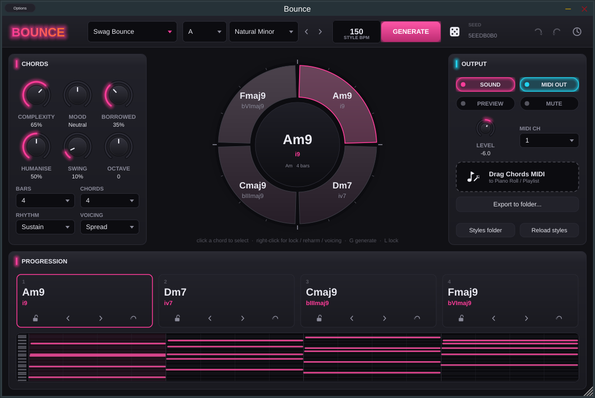

# BOUNCE

A VST3/AU instrument that sketches the building blocks of **swag / bounce** type beats (chords,
808s, melodies, bouncy drums) and helps flip existing songs. It's built for FL Studio first.



> **Status: milestone 1 of 5.** The project skeleton, the music theory core with tests, and the
> **Chord Generator** with drag-to-FL MIDI export are done. 808/bass and melody (M2), drums (M3),
> the Key & BPM Lab (M4) and the final polish (M5) are next. See [`docs/ROADMAP.md`](docs/ROADMAP.md).

## What works today

- **Chord generator.** A weighted-Markov engine built on functional harmony, driven by
  editable **style presets** in JSON. It has key, scale/mode, 2/4/8 bars, 1–8 chords,
  complexity (triads → 9ths/11ths), mood (dark ↔ bright) and borrowed-chord amount.
- **Per-chord editing.** You can lock a chord, reharmonise it, step it through inversions,
  shift its octave, and override its voicing (close, spread, open, 3rd-on-top, flip-stab).
  Transpose and undo/redo cover the whole progression. Chord names (`Fmaj7`, `Em9`) and roman
  numerals (`bVImaj7`, `iv9`) are shown everywhere.
- **Performance.** Chords can sustain, re-strike on half bars, play as syncopated *stabs*
  (the chopped-sample flip feel) or pulse on 8ths, with swing, strum and humanise.
- **Seeds and history.** Every idea has a seed, and the same seed and settings always give the same
  idea on every OS. The last 50 ideas can be recalled from the history menu.
- **Getting it into FL Studio:**
  1. **Drag & drop.** Drag the *Drag Chords MIDI* tile into the Piano Roll or Playlist.
  2. **MIDI out.** The plugin emits its notes as VST3 MIDI output to drive other instruments.
  3. **Export to folder.** Files are named like `Fmaj9-Am9-Dm7-Cmaj9_Am_150bpm_chords.mid`.
- **Built-in sound.** A soft keys/pad voice with chorus and reverb lets you audition ideas
  without any routing.
- **Host sync.** The loop locks to the host playhead and always starts on the bar. When the
  host is stopped, a **Preview** toggle loops the idea on its own.
- **Recall.** All state is saved with the FL project. The UI resizes from 75% to 200%
  (all vector graphics) and animates at 60 fps.

## Building

You need CMake 3.22+ and a C++20 compiler (Visual Studio 2022, Xcode 15+, or GCC 11+/Clang 14+).
JUCE 8.0.9 and doctest are fetched automatically at configure time.

### Windows (VST3 + Standalone)

```bat
cmake -S . -B build -G "Visual Studio 17 2022" -A x64
cmake --build build --config Release --parallel
ctest --test-dir build -C Release --output-on-failure
```

The VST3 is built at `build\plugin\Bounce_artefacts\Release\VST3\Bounce.vst3`. Copy it into
`C:\Program Files\Common Files\VST3\`.

### macOS (VST3 + AU + Standalone, universal)

```sh
cmake -S . -B build -G Xcode "-DCMAKE_OSX_ARCHITECTURES=arm64;x86_64"
cmake --build build --config Release --parallel
ctest --test-dir build -C Release --output-on-failure
```

Copy `Bounce.vst3` to `~/Library/Audio/Plug-Ins/VST3/` and `Bounce.component` to
`~/Library/Audio/Plug-Ins/Components/`.

### Linux

```sh
sudo apt install libasound2-dev libx11-dev libxrandr-dev libxinerama-dev libxext-dev \
                 libxcursor-dev libxcomposite-dev libfreetype-dev libfontconfig1-dev
cmake -S . -B build -G Ninja -DCMAKE_BUILD_TYPE=Release
cmake --build build && ctest --test-dir build --output-on-failure
```

### Core only (no JUCE, fast)

```sh
cmake -S . -B build-core -DBOUNCE_BUILD_PLUGIN=OFF && cmake --build build-core && ctest --test-dir build-core
```

### Offline builds

To build without network access, point CMake at local checkouts:
`-DFETCHCONTENT_SOURCE_DIR_JUCE=/path/to/JUCE -DFETCHCONTENT_SOURCE_DIR_DOCTEST=/path/to/doctest`.

### Validation

CI (`.github/workflows/build.yml`) builds on Windows, macOS and Linux, runs both test suites,
and runs [pluginval](https://github.com/Tracktion/pluginval) at strictness level 10:

```sh
pluginval --strictness-level 10 --validate build/plugin/Bounce_artefacts/Release/VST3/Bounce.vst3
```

## Using it in FL Studio

1. Rescan plugins. Add **Bounce** from *Add ▸ Instruments* (it's a generator).
2. Pick a **style**, **key** and **scale**, then hit **GENERATE** (or press `G`).
3. **Audition.** Press play in FL, or switch on **Preview** to loop it while FL is stopped.
4. **Get the MIDI.** There are three ways:
   - **Drag** the *Drag Chords MIDI* tile onto the Piano Roll of any channel, or onto the
     Playlist to create a pattern.
   - **MIDI out.** Open the plugin wrapper's ⚙ *Settings* and set an **Output port** number. On
     the instrument you want to drive (FL's own plugins or third-party ones), set the same number
     as its **Input port**. Turn off **Sound** in Bounce if you only want the other instrument.
   - **Export to folder** writes the `.mid` for the Browser.
5. **Shape the idea.** Lock the chords you like (`L` or the lock icon), then Generate again and
   only the unlocked chords change. Right-click any chord for reharmonise, inversion, octave
   and voicing. Turning **Complexity / Mood / Borrowed** re-colours the *same* idea (same seed),
   and **Key** transposes it.
6. Everything is saved with the FL project. Open the history (🕘) to go back to an earlier idea.

Keyboard: `G` generate · `L` lock · `R` reharmonise · `1–8` select chord · `←/→` previous/next ·
`↑/↓` invert · `Ctrl/Cmd+Z` undo · `Ctrl/Cmd+Shift+Z` or `Ctrl+Y` redo.

## Style presets

The styles are JSON files in [`presets/styles`](presets/styles): *Swag Bounce*,
*Sped-Up Flip*, *Dark Swag*, *Plugg-ish* and *Melodic R&B Bounce*. They're compiled into the
plugin, and files in your user styles folder are added on top. Use the **Styles folder** button
to open it and **Reload styles** after editing, with no restart needed. The format is documented
in [`presets/styles/README.md`](presets/styles/README.md).

## Repository layout

```
core/      bounce_core: pure C++20, no JUCE. Music theory, generators, MIDI files, JSON.
plugin/    JUCE plugin: processor, engine (RT audio), session state, UI.
presets/   Style presets (JSON), bundled into the binary.
tests/     doctest unit tests (core) + engine tests (JUCE, real-time player).
docs/      Architecture notes, roadmap, milestone reports.
```

See [`docs/ARCHITECTURE.md`](docs/ARCHITECTURE.md) for the threading model and design decisions,
and [`docs/MILESTONE-1.md`](docs/MILESTONE-1.md) for this milestone's report.

## Licensing notes

No copyrighted audio is bundled. The Key & BPM Lab (milestone 4) will only analyse audio that you
load yourself. JUCE is used under its GPLv3/commercial dual licence: shipping closed-source
binaries requires a JUCE licence.
